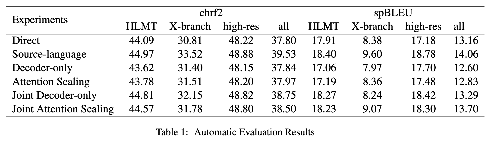
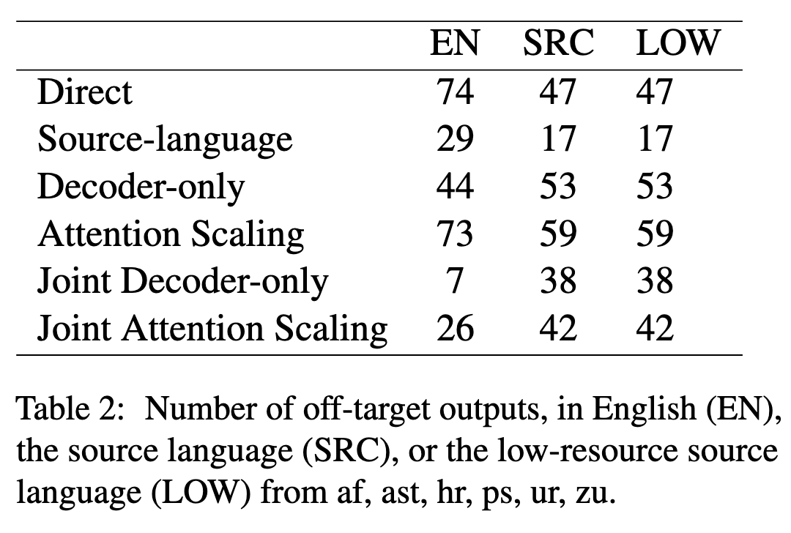
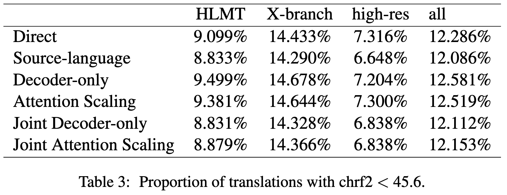
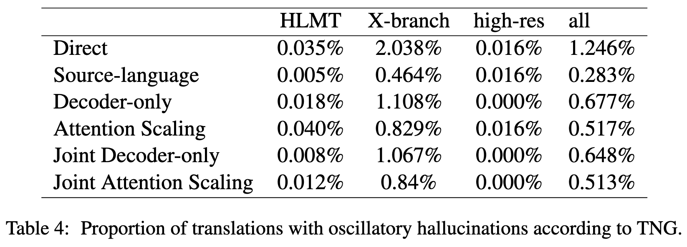
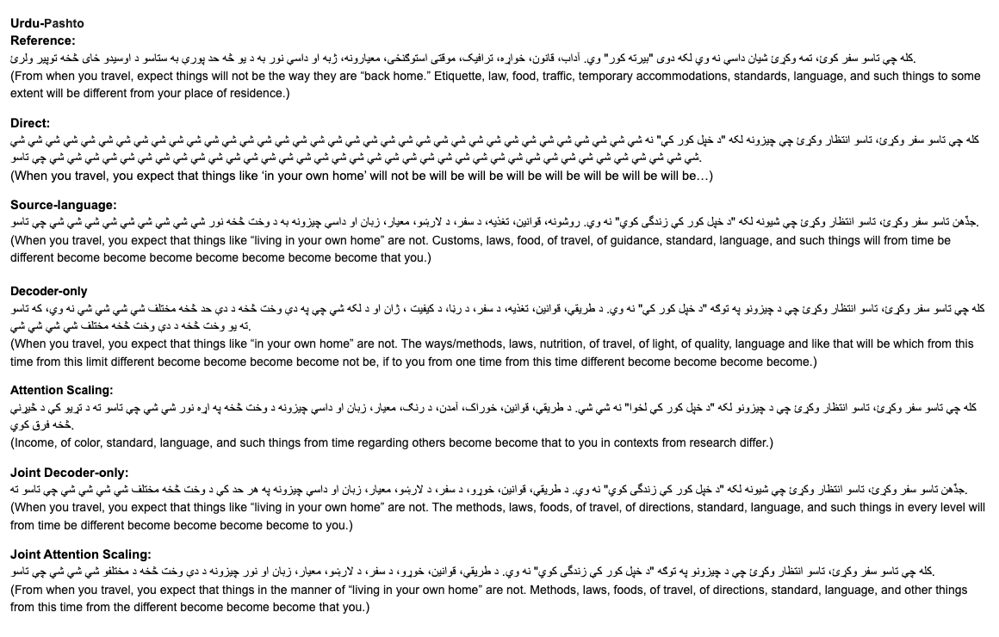

# Joint Contrastive Decoding


This repository implements a joint contrastive decoding framework that combines source-contrastive and language-contrastive decoding [Sennrich et al. (EACL 2024)](https://arxiv.org/abs/2309.07098) with teacher-student model constrastive decoding [Waldendorf et al., EACL 2024)](https://aclanthology.org/2024.eacl-long.155/).

- In **source-contrastive decoding**, we search for a translation that maximizes P(_Y_|_X_) - λ·P(_Y_|_X'_), where _X'_ is a random source segment. This penalizes hallucinations.

- In **language-contrastive decoding**, we search for a translation that maximizes P(_Y_|_X_,_l_y_) - λ·P(_Y_|_X_,_l_y'_), where _l_y_ is the language indicator for the desired target language, _l_y'_ the indicator for some undesired language (such as English or the source language). This penalizes off-target translations.

- In **teacher-student contrastive decoding**, we use a weak student model prone to generate hallucination translations and penalize the generation from the student model. This can also mitigate hallucinations.

<p align="center">

</p>

## Installation

- `pip install -r requirements.txt`

## Usage

Create an out folder:
- `mkdir out`

**Example commands**

Run preprocessing script to get the dataset with non-hallucination instances filtered out:
- `python data_preparation/preprocessing.py --model_path small100`

Run all models for all language pairs and generate translations and evaluation results in the `out` folder:
- `python scripts/run_all_pairs.py --model_path small100`

Run automatic evaluation results:
- `python scripts/run_autoeval.py --model_path small100`

Run hallucination statistics results:
- `python scripts/run_statistics.py --root_dir out/flores/small100`

## Dataset and Models:

This repository uses [FLORES-101](https://huggingface.co/datasets/gsarti/flores_101) for evaluation. ```dev``` section is used for the evaluation. Highly non-hallucinated instances are filtered out.

Multiple models are implemented:

- [M2M-100 (418M)](https://huggingface.co/facebook/m2m100_418M). Use `--model_path m2m100_418M`
- [SMaLL-100](https://huggingface.co/alirezamsh/small100). Use `--model_path small100`

## Experiment Results:
chrf2 and spBLEU evaluation results:
<p align="center">

</p>

Number of off-target outputs, in English (EN), the source language (SRC), or the low-resource source language (LOW) from af, ast, hr, ps, ur, zu:
<p align="center">

</p>

Proportion of translations with chrf2 < 45.6:
<p align="center">

</p>

Proportion of translations with oscillatory hallucinations according to TNG:
<p align="center">

</p>

A translation example for the language pair `Urdu-Pashto`:
<p align="center">

</p>
